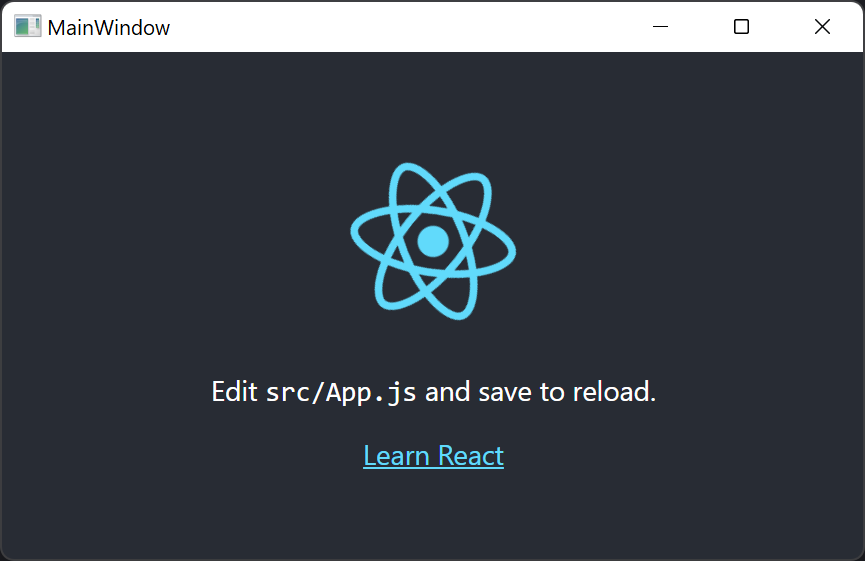

# WPF Hosted JS App

## Description
A Visual Studio 2022 Solution that creates an WPF based application that wraps a WebView2 component which loads a JavaScript application.

## Install
[install_win.zip](https://github.com/PhillipRC/WpfHostedJsApp/blob/main/install_win.zip?raw=true)

## Prerequisite
- Windows 10+
- Visual Studio 2022
  - .NET 6
  - [Microsoft Visual Studio Installer Projects 2022](https://marketplace.visualstudio.com/items?itemName=VisualStudioClient.MicrosoftVisualStudio2022InstallerProjects)
- NodeJS 16

## References
- [Windows Presentation Foundation](https://en.wikipedia.org/wiki/Windows_Presentation_Foundation)
- [WebView2](https://docs.microsoft.com/en-us/microsoft-edge/webview2/)
- [React](https://reactjs.org/)

## Example Output


## Challenges
### Building the JavaScript application in Visual Studio
A JavaScript project name with capital letters caused build errors

### Setup the JavaScript application to build
By default there is no build command defined

- Open project properties
- Build > General > Build Command
  - `npm run build`

### Including the JavaScript application files in the WpfHost
Visual Studio does not have a UI for linking a folder.

- Unload the WpfHost project
- Edit Project File

```xml
<ItemGroup>
    <Content Include="..\jsapp\build\**\*.*">
        <Link>jsapp\%(RecursiveDir)%(FileName)%(Extension)</Link>
        <CopyToOutputDirectory>PreserveNewest</CopyToOutputDirectory>
    </Content>
</ItemGroup>
```
